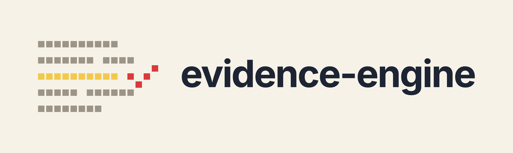

<div align="center">



# Does the paper actually say that?

**Checks the claims in a biomedical paper against the papers it cites, and shows you the passages it found.**

<a href="#run-it"></a>
<a href="#run-it"></a>
<a href="LICENSE"></a>

</div>

---

Checking that a cited study really backs a sentence means opening the paper and hunting for the passage. evidence-engine does that first pass for you: it pulls the claims out of your draft, finds the matching passages in the papers you cite, and sorts the claims so the likely problems come first.

## What you get back

Each claim gets one of four verdicts, shown in this order:

| Verdict | What it means |
|---|---|
| **Contradicted** | A passage in the cited paper says otherwise. |
| **Needs Review** | It couldn't check the claim, for example because it cites a paper you didn't upload. |
| **Insufficient Support** | Nothing it found clearly backs or contradicts the claim. |
| **Supported** | A passage in the cited paper backs the claim. |

Supported needs a model score of at least 0.92 out of 1, and Contradicted at least 0.75, so anything less clear lands in Insufficient Support. Each claim shows the passages it was checked against, and you approve, reject, or mark it insufficient.

Upload only your draft and each claim is checked against the rest of the same paper instead. That can catch a paper contradicting itself, but it isn't a citation check, so a Supported verdict there never shows more than 80% confidence.

## How it works

1. **Find claims.** It splits the draft into sentences and keeps up to 25 that look like checkable facts, favoring ones with a citation. This step is NLTK plus hand-written filters.
2. **Match citations.** A marker like `[3]`, `(12)` or `(Smith et al., 2023)` is matched to one of the papers you uploaded.
3. **Find passages.** It searches that paper, or all your uploads if the claim has no citation, by keyword (BM25) and by meaning (BGE embeddings). A second model re-scores the results and keeps the best two.
4. **Judge.** A small model trained to tell whether one text supports or contradicts another (an NLI model, `cross-encoder/nli-deberta-v3-small`) scores the claim against each passage. The project's own copy was further trained on SciFact, a set of biomedical claims.

No large language model (LLM) decides anything. The only LLM is the optional "Explain this verdict" button. More detail in [docs/ARCHITECTURE.md](docs/ARCHITECTURE.md) and [docs/TRUST_MODEL.md](docs/TRUST_MODEL.md).

## Run it

You need [uv](https://docs.astral.sh/uv/), Node 20+, Docker, and libmagic (`brew install libmagic` on macOS, `apt install libmagic1` on Debian or Ubuntu).

```bash
docker compose up -d          # Postgres 16
uv sync
npm ci && npm run build:css   # the dashboard's CSS
uv run python -m nltk.downloader punkt_tab averaged_perceptron_tagger_eng
uv run alembic upgrade head
uv run uvicorn evidenceengine.api.app:app
```

Open http://localhost:8000/upload and add your draft plus the papers it cites (PDF or DOCX, up to 50 MB each). The first run downloads about 1 GB of models. A run takes minutes on a CPU, and the verdict step is the slow part.

No `.env` file is needed for this. Set these only if you need them:

| Variable | When |
|---|---|
| `DATABASE_URL` | You use your own Postgres instead of the one from `docker compose`. |
| `NLI_MODEL_PATH` | You have a copy of the model trained on SciFact. |
| `LLM_API_KEY` | You want the Explain button. It sends the claim and its top passages to an outside LLM, Gemini by default. |

## Good to know

- **Not medical advice.** It checks whether the papers you cite back up your sentences. It says nothing about whether a treatment works or is safe.
- **Built for biomedical papers.** On other fields the verdicts can look just as sure and still be wrong, and it won't warn you.
- **The SciFact-trained model isn't in this repo.** Without `NLI_MODEL_PATH` you get the plain `cross-encoder/nli-deberta-v3-small`. [`eval/scifact/finetune.py`](eval/scifact/finetune.py) is the script that trains it.
- **It prefers sentences with a citation**, so your own uncited findings rarely get checked.
- **Scanned PDFs give nothing back.** There's no OCR. Citations written as superscript numbers aren't picked up either.
- **No login and no rate limit.** Run it on your own machine, not on the open internet.
- **Your papers stay on your machine.** Only the Explain button sends anything to an LLM, and only once you set `LLM_API_KEY`. The models download from Hugging Face on the first run.
- **No accuracy numbers yet.** The eval scripts are in [`eval/`](eval/README.md), but no results are committed, and the one committed benchmark is climate claims, not biomedical.

## Contributing

Issues and pull requests are welcome. [CHALLENGES.md](CHALLENGES.md) lists the known gaps.

## License

MIT. The SciFact data the eval scripts download is CC BY-NC 2.0, and PyMuPDF, which reads the PDFs, is AGPL-3.0. Read [ATTRIBUTIONS.md](ATTRIBUTIONS.md) before you redistribute or host it.
