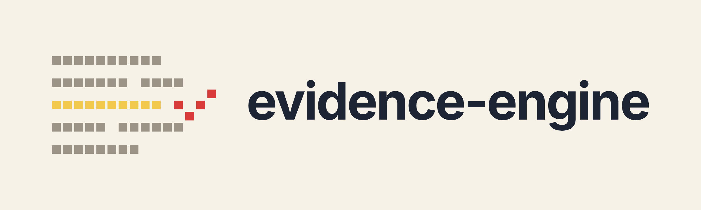

<div align="center">



# Does the paper actually say that?

**Checks the claims in a biomedical paper against the papers it cites, and shows you the passages it found.**

<a href="LICENSE"></a>

</div>

---

Checking that a cited study backs a sentence means opening the paper and hunting for the passage. evidence-engine does that first pass for you and puts the likely problems first.

## What you get back

Each claim gets one of four verdicts:

| Verdict | What it means |
|---|---|
| **Contradicted** | A passage in the cited paper says otherwise. |
| **Needs Review** | It couldn't check the claim, for example because the cited paper wasn't uploaded. |
| **Insufficient Support** | Nothing it found clearly backs or contradicts the claim. |
| **Supported** | A passage in the cited paper backs the claim. |

You see the passages behind every verdict, and you approve or reject it.

## How it works

1. It picks out the sentences in your draft that make checkable claims.
2. It matches each claim to the paper it cites.
3. It finds the passages in that paper that relate to the claim.
4. A model trained to tell agreement from contradiction compares them.

No chatbot makes the call. The optional "Explain this verdict" button is the only place one is used.

## Run it

You need [uv](https://docs.astral.sh/uv/), Node 20 or newer, Docker, and libmagic (`brew install libmagic` on macOS, `apt install libmagic1` on Debian or Ubuntu).

```bash
docker compose up -d
uv sync
npm ci && npm run build:css
uv run python -m nltk.downloader punkt_tab averaged_perceptron_tagger_eng
uv run alembic upgrade head
uv run uvicorn evidenceengine.api.app:app
```

Open http://localhost:8000/upload and add your draft plus the papers it cites. The first run downloads the models, so give it a while. Optional settings are in [.env.example](.env.example).

## Good to know

- **Not medical advice.** It checks whether your sources back your sentences, not whether a treatment works.
- **Built for biomedical papers.** On other subjects it can sound just as sure and still be wrong.
- **Scanned PDFs don't work.** It needs text it can read.
- **Run it on your own machine.** It has no login.
- **Your papers stay with you** unless you use the Explain button.

## Contributing

Issues and pull requests are welcome. [CHALLENGES.md](CHALLENGES.md) lists the known gaps.

## License

MIT. Some data and libraries it uses have their own terms, so read [ATTRIBUTIONS.md](ATTRIBUTIONS.md) before you redistribute or host it.
